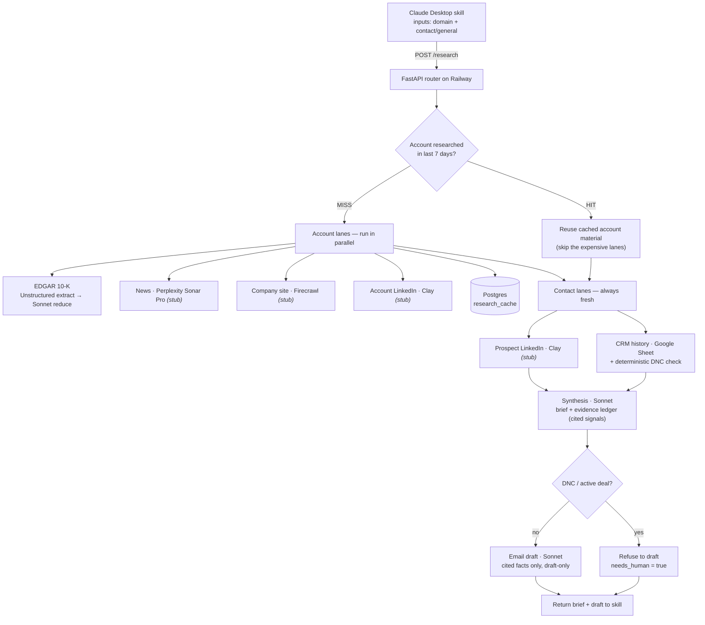

# HT Highlighter

# Loom Walkthrough: https://github.com/onieves10/ht-highlighter

**Timeline tracked**
- ~1.5 hrs to lay out thoughts & whiteboard in a Google Doc
- ~30 min to clean up thoughts into the OUTLINE NOTES section, while Claude Code built a basic prototype end to end and deployed the repo + prototype via GitHub CLI and Railway CLI
- included pauses to adjust prompts (indexed on proper representation of variables and output format)

_next day_
- ~10 min review deployment
- ~20 min testing prototype
- ~20 min finalizing GH + diagram + notes

An agentic SDR research + outreach workflow. Give it an account domain (and
optionally a contact) and it returns a **grounded research brief** — every claim
carries a source and a verbatim snippet — plus a **first-draft email** built only
from cited facts. A human always reviews and sends.

Built for the GTM problem: SDRs burning 3+ hours a day stitching together
LinkedIn, the CRM, news, and 10-Ks to write one semi-personalized email.

> Scope note: this repo is both the design deliverable (architecture, prompts,
> measurement, rollout, failure modes — see [`NOTES.md`](NOTES.md)) and a working
> reference implementation. Some lanes are live, some are stubbed on purpose —
> see [What's live vs. stubbed](#whats-live-vs-stubbed).

## Architecture



## How it works, end to end

1. **Trigger.** The rep invokes the Claude Desktop skill with two inputs: a
   domain and a contact (name/title) or "general."
2. **Cache check.** The router asks Postgres: has this *account* been researched
   in the last 7 days? Account-level research is cached; contact-level work never
   is.
3. **Account lanes (on a miss), in parallel.** EDGAR pulls the latest 10-K and a
   Sonnet "reduce" step compresses Items 1/1A/7 into a few quoted facts. News,
   site, and account-LinkedIn lanes are stubbed (see below). The result is cached.
4. **Contact lanes, always fresh.** CRM history (prior emails/transcripts) plus a
   deterministic **Do-Not-Contact** check; prospect LinkedIn (stubbed).
5. **Synthesis.** One Sonnet call turns everything into a brief where every fact
   lives in `signals[]` with a source, snippet, and confidence. Missing data is
   recorded in `gaps[]`, never invented. Public/private and DNC are overridden in
   code, not left to the model.
6. **Draft.** If DNC, the router refuses to draft and returns `needs_human`.
   Otherwise Sonnet writes a short email using only cited, medium/high-confidence
   facts. Every hook is listed in `cited_facts`.

## Tool choices

| Lane / step | Tool | Why |
|---|---|---|
| 10-K / SEC | **SEC EDGAR API** + **Unstructured** (extract) + **Claude Sonnet** (reduce) | Free, authoritative, real source URL for citations. Unstructured turns messy filing HTML into clean chunks; Sonnet reduces to quoted facts. |
| Recent news | **Perplexity Sonar Pro** | Live web search with inline citations — grounding for free. |
| Company site | **Firecrawl** | Deterministic scrape of pages we control the source of (pricing, careers, blog). |
| Person / LinkedIn | **Clay** (waterfall) | LinkedIn-grade person data needs a provider waterfall, not a general web LLM. |
| Synthesis + drafting | **Claude Sonnet** | Strongest instruction-following for strict-schema output and voice. |
| CRM | **Salesforce** (faked here with a published Google Sheet) | Prior-touch context is the real differentiator. |
| Cache / host | **Railway** + **Postgres** | Postgres hosting next to a deployed repo, one click. |

## What's live vs. stubbed

**Live and tested:** EDGAR 10-K pull + reduce, CRM read from the Google Sheet,
the two Claude calls (synthesis + draft) against strict schemas, the Postgres
(Railway) / in-memory cache with real miss→hit behavior, and the deterministic
DNC + public/private guards.

**Stubbed on purpose (time box):** the news (Perplexity), company-site
(Firecrawl), and LinkedIn (Clay) lanes return labeled placeholders — their real
prompts/config still ship in [`prompts/`](prompts/). pgVector isn't wired (nothing
to retrieve against at single-account scale yet). Full rationale in
[`NOTES.md`](NOTES.md).

## Repo layout

```
router.py            FastAPI /research — the deterministic router
config.py            env loading (.env, gitignored)
llm.py               Claude calls + prompt/schema loaders + JSON-repair retry
db.py                Postgres cache (research_cache) with in-memory fallback
lanes/edgar.py       LIVE — CIK lookup, public/private branch, 10-K, reduce
lanes/crm.py         LIVE — Google Sheet read, DNC check, empty-field degrade
lanes/stubs.py       news / site / LinkedIn placeholders
schemas/*.json       strict output schemas (brief w/ evidence ledger, email)
prompts/*.md         all prompts (synthesis, email, edgar-reduce, + stubbed lanes)
skill/               Claude Desktop skill (SKILL.md + call_ht.py)
NOTES.md             raw thinking: measurement, rollout, failure modes
```

## Run locally

```bash
python3 -m venv .venv && .venv/bin/pip install -r requirements.txt
cp .env.example .env        # fill ANTHROPIC_API_KEY, CRM_CSV_URL; DATABASE_URL optional
.venv/bin/uvicorn router:app --reload
# then:
curl -s localhost:8000/research -H 'content-type: application/json' \
  -d '{"domain":"snowflake.com","contact":"Priya Raman","mode":"person"}' | python3 -m json.tool
```

With no `DATABASE_URL`, the cache runs in-memory. Set it to a Railway/local
Postgres URL to persist across restarts.

## Deploy to Railway

1. New project → Deploy from repo. Railway detects the `Procfile`.
2. Add a Postgres plugin — `DATABASE_URL` is injected automatically.
3. Set `ANTHROPIC_API_KEY`, `CRM_CSV_URL`, `SEC_USER_AGENT` as service variables.
4. Point the skill at the public URL: `HT_ENDPOINT="https://<app>.up.railway.app"`.

## Security

`.env` is gitignored; no secrets are committed. SEC EDGAR requires a `User-Agent`
with contact info (set via `SEC_USER_AGENT`).
